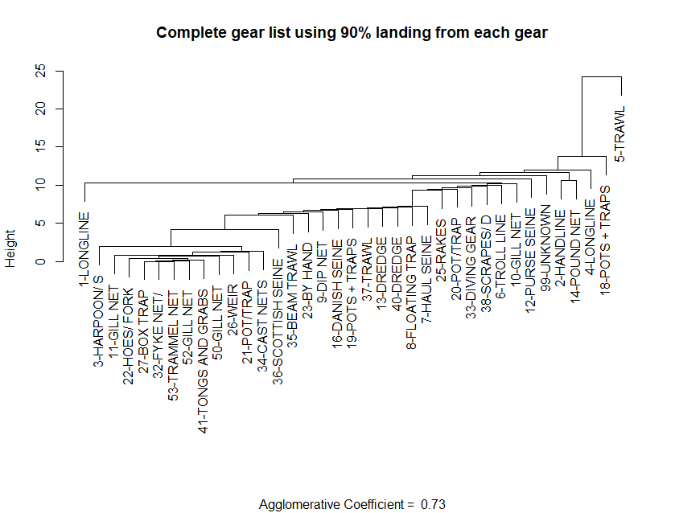

```{r setup, include=FALSE}
knitr::opts_chunk$set(echo = TRUE)
library(magrittr)
```


```{r getGears,  echo=F, eval=T}
gears <- readRDS(here::here("data","gearCodeTable.rds"))
gearCodes <- gears$data %>% 
  dplyr::arrange(NEGEAR,NEGEAR2) %>%
  dplyr::select(NEGEAR,NEGEAR2,GEARNM,NAFOGEAR,NAFOGRNM)
numGears <- length(unique(gearCodes$NEGEAR2))

gearData <- readRDS(file=here::here("data","gearLandingsBySpecies.rds"))
gearTypes <- unique(gearData$data$NEGEAR2)
numGearsGB <- length(gearTypes)
```
There are a total of `r numGears` unique NEGEAR2 codes (found in the cfdbs.gear table). However on Georges Bank not all of these fishing gears are used. A subset of `r numGearsGB` gear types are used. A list of these codes follow

```{r printGearTable, echo=F,eval=T}

GBCodes <- gearCodes %>% dplyr::filter(NEGEAR2 %in% sprintf("%02d",gearTypes)) %>% 
  dplyr::select(-NEGEAR,-NAFOGEAR,-NAFOGRNM) 

DT::datatable(GBCodes,rownames = FALSE, 
          options = list(pageLength = 10, 
                         order = list(list(0, 'asc'))
          ))

```

## Aggregating Gear Types

Each gear type is designed to target particular species. Some gear types may catch predominantly one species (eg. Lobsters traps) where others may catch multiple species (bottom trawls). We aim to aggregate the gear types into fleets using similarities in the catch among the gear types. To achieve this we will adopt an agglomerative hierarchical, nearest neighbor clustering method (@manly2017) using euclidean distance as the measure of distance between groups. In this approach all gear types begin in separate groups. Groups that are similar (similar catch, defined by a distance mesaure) are then merged until at some distance all gear types belong to a single group. The variables used to determine the grouping are the species caught, measured by landings (in lbs)

Landings data, by gear type, are pulled from the database. 
```{r pulldata, echo=T,eval=F}
channel <- dbutils::connect_to_database("server","id")
get_landings_by_data(channel,percentLanded=0.90,area=c(cfdbs::EPUs$data[["GB"]],537),outDir=here::here("data"))
```

The landings of each species are aggregated over time and then ordered from the most abundant to least abundant. To reduce the number of variables (species) in the analysis we only use species which comprise 90% of the total landings. The resulting data are then formatted as a data frame (or matrix) where each gear type is represented in a row and each species in a column. Each cell being the landings of the species by the gear type. Note: There will be many zeros in the data frame representing gear types that do not catch a particular species.

The variables are often standardized so that all of the variables are equally important in determining distances. We standardize each variable to have zero mean and unit variance. At this point pairwise distances between all gear types are calculated using the Euclidean distance function

$$d_{i,j} = \left( \sum_{k=1}^p(x_{i,k}-x_{j,k})^2 \right) ^{1/2} $$
where $x_{i,k}$ is the landings of species $k$ by gear type $i$ and $x_{j,k}$ is the landings of species $k$ by gear type $j$. $d_{i,j}$ is the measure of distance between gear type $i$ and $j$

A dendrogram (Figure \@ref(fig:dendro1)) is then formed using the agglomerative hierarchical process. This process is carried out using the statistical package `cluster`(@cluster211) in R. Initial inspection indicates further "cleaning" of the data is required. 

```{r cluster1, echo=T,eval=F}
clusterObj <- cluster_analysis_all_gears()
plot(clusterObj,ask=T,which.plots=2,main="Complete gear list using 90% landing from each gear",xlab="")

```
```{r dendro1,out.width="100%",fig.cap="The denrogram obtained from a nearest-neighbor, hierarchical cluster analysis on all gears used in the Georges Bank Ecological Production unit defined by statistical areas"}

```


## References

