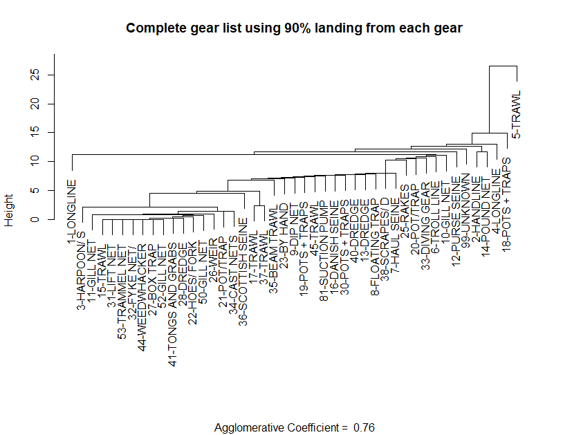

```{r setup, include=FALSE}
knitr::opts_chunk$set(echo = TRUE)
library(magrittr)
options(warn=-1)
```

## Spatial Extent

Statistical areas are used to define the Georges Bank footprint for pulling the landings data by gear
```{r}
crs <- 4326
# read in coastline and GB shape file
coast <- sf::st_read(here::here("data-raw/gis", 'NES_LME_coast.shp'), quiet = T) %>%
  sf::st_transform(.,crs=crs)
GB_strata <- sf::st_read(here::here("data-raw/gis","Statistical_Areas_2010.shp"),quiet=T) %>%
    sf::st_transform(.,crs=crs) %>%
  dplyr::filter(Id %in% c(521, 522, 523, 524, 525, 526, 538, 551, 552, 561, 562, 537) )
centroids <- sf::st_coordinates(sf::st_centroid(GB_strata))
GB_strata <- cbind(GB_strata,centroids)

#plot map
ggplot2::ggplot(data=coast) +
  ggplot2::geom_sf() +
  ggplot2::geom_sf(data=GB_strata,fill="grey") + 
  ggplot2::geom_text(data=GB_strata,ggplot2::aes(x=X,y=Y,label=Id),size=2)    +
  ggplot2::coord_sf(xlim = c(-76,-65), ylim = c(38,44))
```

## Gear Types

```{r getGears,  echo=F, eval=T}
gears <- readRDS(here::here("data-raw/data","gearCodeTable.rds"))
gearCodes <- gears$data %>% 
  dplyr::arrange(NEGEAR,NEGEAR2) %>%
  dplyr::select(NEGEAR,NEGEAR2,GEARNM,NAFOGEAR,NAFOGRNM)
numGears <- length(unique(gearCodes$NEGEAR2))

```
There are a total of `r numGears` unique NEGEAR2 codes (found in the cfdbs.gear table). However on Georges Bank not all of these fishing gears are used. A subset of 45 gear types are used. All gear codes:

```{r printGearTable, echo=F,eval=T}

GBCodes <- gearCodes %>% 
  dplyr::select(-NEGEAR,-NAFOGEAR,-NAFOGRNM) 

DT::datatable(GBCodes,rownames = FALSE, 
          options = list(pageLength = 10, 
                         order = list(list(0, 'asc'))
          ))

```

## Aggregating Gear Types

Each gear type is designed to target particular species. Some gear types may catch predominantly one species (eg. Lobsters traps) where others may catch multiple species (bottom trawls). We aim to aggregate the gear types into fleets using similarities in the catch among the gear types. To achieve this we will adopt an agglomerative hierarchical, nearest neighbor clustering method (@manly2017) using euclidean distance as the measure of distance between groups. In this approach all gear types begin in separate groups. Groups that are similar (similar catch, defined by a distance measure) are then merged until at some distance all gear types belong to a single group. The variables used to determine the grouping are the species caught, measured by landings (in lbs)

Landings data, by gear type, are pulled from the database. 
```{r pulldata, echo=T,eval=F}
channel <- dbutils::connect_to_database("server","id")
get_landings_by_data(channel,percentLanded=0.90,area=c(cfdbs::EPUs$data[["GB"]],537),outDir=here::here("data"))
```

The resulting data are then formatted as a data frame (or matrix) where each gear type is represented in a row and each species in a column. Each cell being the landings of the species by the gear type. Note: There will be many zeros in the data frame representing gear types that do not catch a particular species.

The variables are often standardized so that all of the variables are equally important in determining distances. We standardize each variable to have zero mean and unit variance. At this point pairwise distances between all gear types are calculated using the Euclidean distance function

$$d_{i,j} = \left( \sum_{k=1}^p(x_{i,k}-x_{j,k})^2 \right) ^{1/2} $$
where $x_{i,k}$ is the landings of species $k$ by gear type $i$ and $x_{j,k}$ is the landings of species $k$ by gear type $j$. $d_{i,j}$ is the measure of distance between gear type $i$ and $j$

A dendrogram is then formed using the agglomerative hierarchical process. This process is carried out using the statistical package [`cluster`]() (@cluster211) in R.

### Approach: Use all gear types

For each gear type the landings of each species are aggregated over time and then ordered from the most abundant to least abundant. To reduce the number of variables (species) in the analysis we only use species which comprise 90% of the total landings for each gear type.

(Figure \@ref(fig:dendro1)) shows the result of this approach. Initial inspection indicates further "cleaning" of the data is required. 

```{r cluster1, echo=T,eval=F}
clusterObj <- cluster_analysis_all_gears()
plot(clusterObj,ask=T,which.plots=2,main="Complete gear list using 90% landing from each gear",xlab="")

```

```{r dendro1,out.width="100%",fig.cap="The dendrogram obtained from a nearest-neighbor, hierarchical cluster analysis on all gear types used in the Georges Bank Ecological Production unit as defined by statistical areas",eval=T,echo=F}

```
Note: Low values of the agglomerative coefficient indicate tight clustering of gears types. Larger values indicate less well formed clusters.


### Approach: Use gears responsible for most landings

Total landings, aggregated over time, are ordered by gear type. The gear types that contribute to 99% of total landings are selected and used in the cluster analysis


```{r cluster2, echo=T,eval=F}
clusterObj <- cluster_analysis_filter_gears(filterByLandings=.99)
plot(clusterObj$top,ask=T,which.plots=2,main="Gear types contributing to 99% of total landings",xlab="")

```


```{r dendro2,out.width="100%",fig.cap="The dendrogram obtained from a nearest-neighbor, hierarchical cluster analysis on a subset of gear types in the Georges Bank Ecological Production unit as defined by statistical areas. Gear types were selected based on their contribution to 99% of landings",eval=T,echo=F}


```


### Species landings by gear {.tabset .tabset-pills}

Time series of species caught by each gear type. To reduce the number of panels in each figure, species caught < 30% of the time are not displayed. For example reporting of landings started in 1964 (56 years ago). So any species that have reported landings in fewer that 17 years are not displayed.


```{r plotGearTop, echo=T,eval=F}
for (gear in clusteObj$topGears) {
  explore_landings_by_gear(channel,data=gearData$data,gearCode=gear,filterYrs=0.30,saveToFile=T)
}

```


#### 01

```{r gear01,  echo=F, eval =T}
GBCodes %>% dplyr::filter(NEGEAR2=="01")
knitr::include_graphics("figures/gear01.png")
```

#### 02
```{r gear02,  echo=F, eval =T}
GBCodes %>% dplyr::filter(NEGEAR2=="02")

```

#### 05

```{r gear05,  echo=F, eval =T}
GBCodes %>% dplyr::filter(NEGEAR2=="05")

```

#### 10

```{r gear10,  echo=F, eval =T}
GBCodes %>% dplyr::filter(NEGEAR2=="10")
knitr::include_graphics("figures/gear10.png")
```

#### 12

```{r gear12,  echo=F, eval =T}
GBCodes %>% dplyr::filter(NEGEAR2=="12")
knitr::include_graphics("figures/gear12.png")
```

#### 13

```{r gear13,  echo=F, eval =T}
GBCodes %>% dplyr::filter(NEGEAR2=="13")
knitr::include_graphics("figures/gear13.png")
```

#### 14

```{r gear14,  echo=F, eval =T}
GBCodes %>% dplyr::filter(NEGEAR2=="14")

```

#### 17
```{r gear17,  echo=F, eval =T}
GBCodes %>% dplyr::filter(NEGEAR2=="17")
knitr::include_graphics("figures/gear17.png")
```

#### 18
```{r gear18,  echo=F, eval =T}
GBCodes %>% dplyr::filter(NEGEAR2=="18")

```

#### 20
```{r gear20,  echo=F, eval =T}
GBCodes %>% dplyr::filter(NEGEAR2=="20")

```

#### 21
```{r gear21,  echo=F, eval =T}
GBCodes %>% dplyr::filter(NEGEAR2=="21")
knitr::include_graphics("figures/gear21.png")
```

#### 30
```{r gear30,  echo=F, eval =T}
GBCodes %>% dplyr::filter(NEGEAR2=="30")
knitr::include_graphics("figures/gear30.png")
```

#### 37
```{r gear37,  echo=F, eval =T}
GBCodes %>% dplyr::filter(NEGEAR2=="37")
knitr::include_graphics("figures/gear37.png")
```

#### 38
```{r gear38,  echo=F, eval =T}
GBCodes %>% dplyr::filter(NEGEAR2=="38")
knitr::include_graphics("figures/gear38.png")
```

#### 40
```{r gear40,  echo=F, eval =T}
GBCodes %>% dplyr::filter(NEGEAR2=="40")
knitr::include_graphics("figures/gear40.png")
```

### Gears that make up < 1% landings

The remaining gears (not contributing to 99% of the landings) were used in a cluster analysis to determine how similar these gears are to each other, since 100% of landings should be accounted for.

```{r cluster3, echo=T,eval=F}
plot(clusterObj$bottom,ask=T,which.plots=2,main="Gear types contributing < 1% of total landings",xlab="")

```


```{r dendro3,out.width="100%",fig.cap="The dendrogram obtained from a nearest-neighbor, hierarchical cluster analysis on a subset of gear types in the Georges Bank Ecological Production unit as defined by statistical areas. Gear types were selected based on not contributing to top 99% of landings",eval=T,echo=F}
knitr::include_graphics("figures/dendrogram3.png")

```
### Approach: Select gear types that catch species of interest

All gear types which catch any amount of the [Species](https://noaa-edab.github.io/ms-keyrun/SpeciesEnvDat.html#focalSpecies) of interest are used in the cluster analysis. The hope was the set of gear types in which to begin the cluster analysis would be substantially less. The number of gears eliminated = 10. It is apparent that species of interest are caught across a broad class of gear types.

```{r echo=T,eval=F}
#focalSpecies <- readRDS(here::here("data-raw/data","focalspecies.rds"))
clusterObj <- cluster_by_focal_species(mskeyrun::focalSpecies)
plot(clusterObj,ask=T,which.plots=2,main="All gear types that land species of interest",xlab="")
```


```{r dendro4,out.width="100%",fig.cap="The dendrogram obtained from a nearest-neighbor, hierarchical cluster analysis on a subset of gear types in the Georges Bank Ecological Production unit as defined by statistical areas. All gear types that landed species of interest were selected",eval=T,echo=F}
knitr::include_graphics("figures/dendrogram4.png")

```

## Bottom trawls (small/large mesh) {.tabset .tabset-pills}

Over time (dates/references????) changes in regulations resulted in the requirement of fisherman to increase the mesh size in their nets. This allowed smaller fish to escape the nets. However there were, and still are, exemptions to this regulation allowing fishermen to fish with smaller meshed nets depending on the time of the year and the area they fish. However all of the associated landings are flagged as using the same gear type code. Since the change in regulations dictate a change in the composition of species caught over time, this gear type needs to be investigated separately. The data base holds information based on the mesh size of the otter trawl nets for NEGEAR code = 5 (from 1982 onward).

Below are plots of species caught in the otter trawl (making up 96% of the total catch from 1964 to 2020) by mesh size (in inches). Note that the figure begins in 1982. Any trip without a mesh size attributed is not displayed, this includes all trips prior to 1982. A lack of mesh size accounts for approximately 20% of landing post 1982 and approximately 50% of all landings

### plotted on same scale
```{r fixed,  echo=F, eval =T}
knitr::include_graphics("figures/demersalfixed.png")
```

### plotted on different scale
```{r free,  echo=F, eval =T}
knitr::include_graphics("figures/demersalfree_y.png")
```

## Decision

This exploratory study resulted in the following designation of [Fleets](https://noaa-edab.github.io/ms-keyrun/articles/GBFleetDecisions.html)


## References

