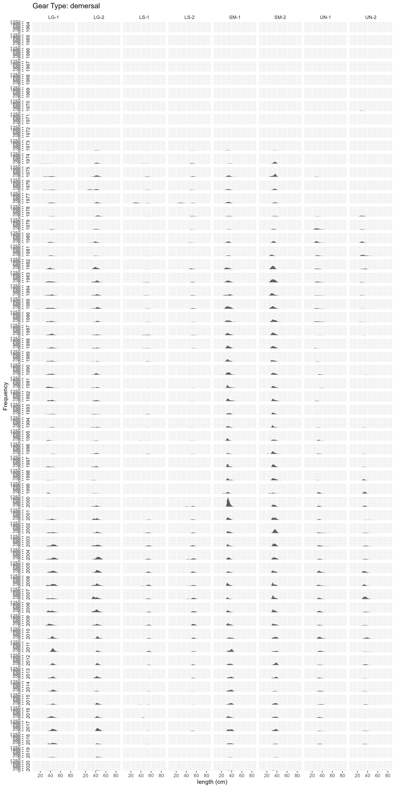
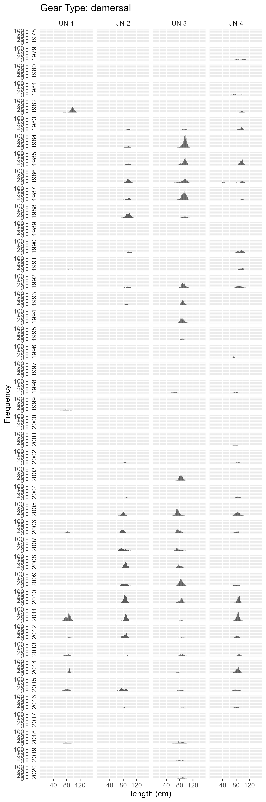
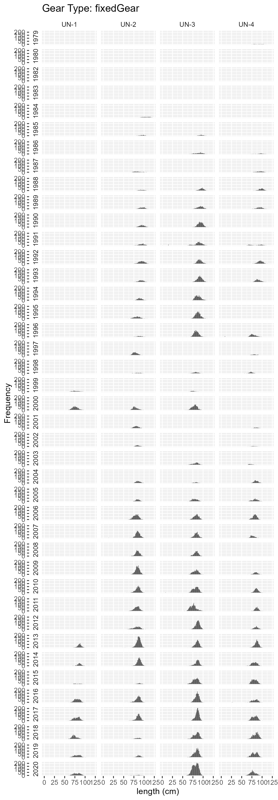
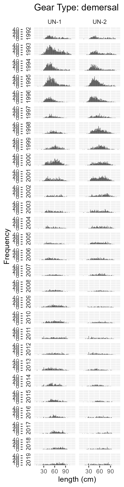

```{r setup, include=FALSE}
knitr::opts_chunk$set(echo = TRUE)
library(magrittr)
library(mskeyrun)
library(mscatch)
source(here::here("data-raw/R/create_species_rules_table.R"))
options(warn=-1)
```

Typically, fish that are landed by fishermen are not measured for length. However samples of the landed fish are taken through time by port samplers at the request of the assessment scientist. The size of the samples (the number of fish sampled) and the frequency of the samples change through time for several reasons. As a result some species are more heavily sampled than others. In addition some species are more heavily sampled during certain times of the year. In many cases the lengthed fish are assigned a market category, for example, Large, Small, Jumbo. Other times they are not and are simple considered Unclassified

For many stock assessment models and multispecies models the catch is often required as a composition of lengths. Due to the nature of the sampling program, length samples are not always available at the level the model requires. In this case there are several options. One of them being to "borrow" length samples from adjacent time periods. This assumes that fish caught from one time period to the next have similar size (length) distributions.

## Expanding catch to a composition of lengths

Hydra, the multispecies length based model, is the only model that requires this type of data. Currently Hydra incorporates three distinct fleets, a demersal fleet, a pelagic fleet, and a fixed gear fleet. This data product categorizes catch by these three fleet types.

The annual catch (measured in metric tons) for each of the [focal species](stockAreas.html#focal) is expanded to a composition of length. The result being that the sum of the catch over all lengths in a given year (or any other time interval) will equal the total catch for that year (or equivalent time interval). Fish are measured in 1 cm increments.

* Commercial fisheries landings were pulled using R package [`comlandr`](https://noaa-edab.github.io/comlandr/)

* The length data were pulled from the commercial fisheries database, specifically the `stockeff.mv_cf_len` table

* The R package [`mscatch`](https://noaa-edab.github.io/mscatch/) is used to expand the annual catch data. Detailed methods are explained there. [Species specific rules](#rules) are used in the expansion to account for life history traits. See [Data sources](GBLandingLengthDataSources.html#function) for more information

* Two data sets of expanded catch are produced:
  * One where length samples are borrowed to fill in years/season/market code with missing length samples, [`realFisheryLencomp`](https://noaa-edab.github.io/ms-keyrun/reference/realFisheryLencomp.html)
  * Another where length samples remain missing. In this cases the landings can not be partitioned into landings at length. For length based models this will represent missing data. [`realFisheryLencompRaw`](https://noaa-edab.github.io/ms-keyrun/reference/realFisheryLencompRaw.html)

## Species rules {#rules}

For each species, a set of rules are applied (similar to the approach taken in a stock assessment), to determine how the landings data and discard data (not currently incorporated) are aggregated based on the availability of length samples. Biomass (metric tons) is then estimated at each LENGTH (1 cm bins) category for a specified time interval, market category, and gear type. The expanded catch is then aggregated to annual time steps and [fleets](https://noaa-edab.github.io/ms-keyrun/articles/GBFleetDecisions.html). 

To create the data set WITH borrowed length samples:
```{r lencompcreate, echo = T,eval = F}
create_real_fishery_lencomp()
```

A sample of the output for Atlantic cod is shown below.

```{r lencomp,echo=F,eval=TRUE}
mskeyrun::realFisheryLencomp %>%
  dplyr::filter(Code == 164712) %>%
  head(.,10) %>%
  flextable::flextable() %>% 
  flextable::colformat_num(j=c("Code","year"), big.mark = "" , digits=0 )
```


To create the data set WITHOUT borrowed length samples:
```{r lencompcreateRaw, echo = T,eval = F}
create_real_fishery_lencomp_raw()
```

A sample of the output for Atlantic cod is shown below.

```{r lencompRaw,echo=F,eval=TRUE}
mskeyrun::realFisheryLencompRaw %>%
  dplyr::filter(Code == 164712) %>%
  head(.,10) %>%
  flextable::flextable() %>% 
  flextable::colformat_num(j=c("Code","year"), big.mark = "" , digits=0 )
```


### Fleet/Gear Types

NEGEAR2 codes observed in the catch data are attributed to one of three fleets. The designation "all" implies all other gear codes. Note that some species are not caught by all three fleets.

```{r speciesgear, echo = F, eval=T}
tab <- create_species_rules_table1("gearCodes","Fleet","Negear2")
tab

```
### Market Codes

In a similar fashion to fleets, the market codes observed in the catch data are relabelled according to assessment scientist recommendations. The designation "all" implies all other market codes

```{r speciesmarket, echo = F, eval=T}
tab <- create_species_rules_table1("marketCodes","Relablled","Market Codes")
tab

```
### Additional preferences

Additional decision points were considered for each species in accordance with stock scientist recommendations. The following table outlines these decision points:

*   `temporalAggregation` = The time scale that catch is expanded to lengths. Quarterly, by semester or annual time scales.
*   `howAggregate` = The method for dealing with missing length samples (at above time scales). *Note: not all stock scientists borrow length samples from other sampled times. This will be addressed at a later date*
*   `LengthWeightData` = The data source for obtaining length and weight data. This data is used to fit length-weight relationships at the level defined by `LengthWeightRelationship`.
*   `LengthWeightRelationship` = The time scale used to fit length-weight relationships. *Note: some stock scientists fit length-weight relationships for each semester in each year. Some fit over a specified time range of survey data. These modifications will be addressed at a later date.*
*   `AgeData` = The data source for obtaining age data. Note that some species do not have age data available and subsequently age based stock assessments are not carried out.
*   `AgeLengthKey` = The time scale used to calculate the Age length key. *Note: some stock scientists use year and quarter, some also incorporate gear type. These modifications will be addressed at a later date. *
*   `maxAge` = The approximate observed maximum age of the species. This is used in the construction of the age length key.

```{r speciesprefs, echo = F, eval=T}
tab <- create_species_rules_table2()
tab

```

### Length sample availability {.tabset}

The figures shown are generated by the function [aggregate_landings](https://noaa-edab.github.io/mscatch/reference/aggregate_landings.html) from the R package [mscatch](https://noaa-edab.github.io/mscatch/articles/mscatch.html). Each figure represents the number and frequency of fish lengths taken by port agents in each year, season, market category, gear type (represented as a fleet)


#### Goosefish

``` {r, echo = F}
knitr::include_graphics("figures/11_demersal_length_frequency_table2_GOOSEFISH.png")
knitr::include_graphics("figures/11_fixedGear_length_frequency_table2_GOOSEFISH.png")
```

#### Atlantic Cod
```{r, echo = F}


```

#### Winter flounder
```{r, echo = F}



```


#### Yellowtail flounder
```{r, echo = F}


```


#### Haddock
```{r, echo = F}

knitr::include_graphics("figures/11_fixedGear_length_frequency_table2_HADDOCK.png")

```


#### Atlantic herring

```{r, echo = F}


```

#### Atlantic mackerel
```{r, echo = F}


```


#### Spiny dogfish
```{r, echo = F}



```


#### Winter skate
```{r, echo = F}


```


#### Silver Hake
```{r, echo = F}


```

